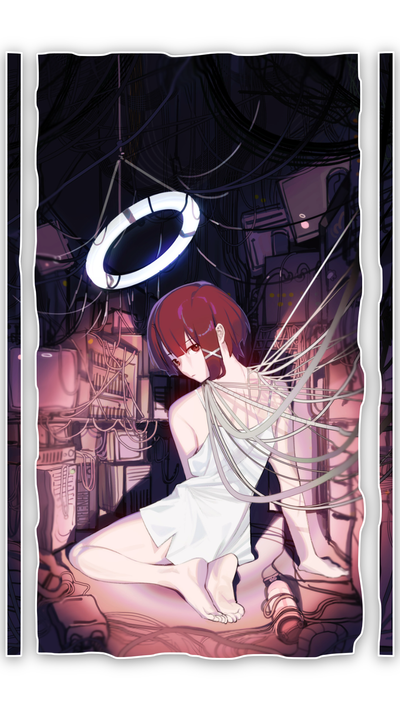

    <h2>Welcome to my Github Profile</h2>
    
    
Full-Stack Developer. I build things, break things, and occasionally ship things.

    
Thank you to everyone who has helped me.

    
    
    
    
    
    
    

